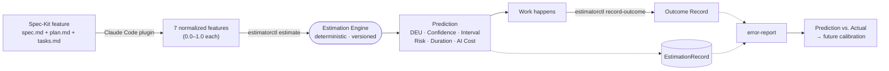

# Delivery Effort Estimator

An AI-native Delivery Effort Estimation Framework: turns the information
already produced while specifying and planning a work item into a
quantitative **Delivery Effort prediction** — with confidence, a range, a
risk label, and separate cost/duration estimates — instead of a
single gut-feel number.

📖 **New here?** Read the [**User Manual**](docs/manual.md) — plain-language
explanation of every concept, the exact formulas, and a fully worked
example.

## How it fits together



Two design choices worth knowing up front:

- **The Estimation Engine never calls an LLM.** Features can come from a
  human typing JSON or from Claude reading a Spec-Kit feature's own docs —
  either way, the actual prediction math is a fixed, deterministic,
  versioned formula. That's what makes it reproducible and calibratable.
- **Nothing is ever overwritten.** A re-estimate, a recorded outcome, a
  future model version — all additive. Old predictions stay exactly as
  reproducible as the day they were made.

Full rationale: [`docs/sdd-estimate.md`](docs/sdd-estimate.md) (the original
design document this repo implements).

## What's implemented

| Piece | What it does | Spec |
|---|---|---|
| **Core Estimation Engine** (`internal/`, `cmd/`) | Takes a 7-dimension feature vector, returns a `Prediction` (DEU, Confidence, Interval, per-dimension Effort, Risk, Duration, AI Cost); persists it as an immutable `EstimationRecord`; accepts an `OutcomeRecord` after delivery; computes an `ErrorReport` comparing prediction vs. actual. | [`specs/001-core-estimation-engine/`](specs/001-core-estimation-engine/) |
| **Feature Extraction Plugin** (`plugin/`) | A Claude Code plugin: after you plan a Spec-Kit feature, it automatically derives the feature vector from `spec.md`/`plan.md`/`tasks.md` (with a justification for every score) and calls the engine — no hand-written JSON needed. | [`specs/002-feature-extraction-plugin/`](specs/002-feature-extraction-plugin/) |

Not built yet (explicitly deferred, see each spec's "Assumptions"):
automatic model calibration from accumulated outcomes, and non-Spec-Kit
specification formats (BDD/DDD/TDD/plain Markdown).

## Quickstart

### Option A — the Claude Code plugin (recommended)

```bash
claude --plugin-dir plugin/
```

Then just use Spec-Kit as normal (`/speckit.specify`, `/speckit.plan`,
`/speckit.tasks`) — an estimation appears automatically once a feature is
planned. Requires a Go toolchain on `PATH`; see
[`plugin/README.md`](plugin/README.md).

### Option B — the CLI directly

```bash
cat > /tmp/features.json <<'EOF'
{
  "context_complexity": 0.72,
  "domain_complexity": 0.41,
  "integration_complexity": 0.83,
  "verification_complexity": 0.67,
  "human_decision_load": 0.54,
  "ai_execution_complexity": 0.38,
  "uncertainty": 0.61
}
EOF

go run ./cmd/estimatorctl estimate --work-item WI-1 --features /tmp/features.json
```

This is the exact example walked through step-by-step in the
[User Manual](docs/manual.md#5-a-worked-example). Or run the HTTP server:

```bash
go run ./cmd/estimatord   # default :8080, see specs/001/contracts/http.md
```

Both binaries persist to `./data/estimator.db` (embedded, pure-Go SQLite —
no CGO, no external database); override with `ESTIMATOR_DB_PATH`.

Full walkthrough (including recording an outcome and reading an error
report): [`specs/001-core-estimation-engine/quickstart.md`](specs/001-core-estimation-engine/quickstart.md).

## Build & test

```bash
make build          # go build ./...
make test           # go test ./... (+ verifies plugin/engine/ isn't out of sync)
make test-plugin    # shell tests for the plugin's hook/build scripts
make vet            # go vet ./...
make fmt            # gofmt -l . (lists any unformatted files)
```

## Project layout

```text
cmd/estimatorctl/        CLI entrypoint
cmd/estimatord/           HTTP JSON entrypoint
internal/estimation/      pure deterministic model (no I/O)
internal/record/          orchestration + storage interfaces
internal/storage/sqlite/  SQLite-backed repository implementation

plugin/                   Claude Code plugin (self-contained, installable on its own)
scripts/                  keeps plugin/engine/ in sync with cmd/ + internal/

docs/
├── manual.md              user manual — concepts, formulas, worked example
└── sdd-estimate.md         the original design document

specs/                     GitHub Spec Kit artifacts (spec/plan/tasks per feature)
.specify/                  Spec Kit scaffolding + this project's constitution
```

## Guiding principles

The full list (10 principles) lives in
[`.specify/memory/constitution.md`](.specify/memory/constitution.md). The
three that shape every output you'll see:

- **Effort ≠ Duration ≠ Cost** — reported separately, never collapsed into
  one number.
- **A prediction, not a commitment** — every estimate is meant to be
  compared against a real outcome later, not treated as a promise.
- **LLMs are not the estimation engine** — an LLM may help derive the
  *inputs*; the quantitative model itself is deterministic and
  provider-independent.
