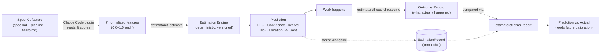

# User Manual — Delivery Effort Estimator

This is a plain-language guide to *what the estimator actually computes*,
*where its inputs come from*, and *how to read its output*. If you want the
formal spec/design rationale instead, see [`specs/`](../specs/) and
[`docs/sdd-estimate.md`](sdd-estimate.md).

## 1. What it does, in one sentence

Given a small set of signals about a piece of work — how complex it is, how
much it touches other systems, how much is still uncertain — it produces a
**Delivery Effort prediction**: an effort estimate broken down by who/what
does the work (human vs. AI), a confidence level, a range instead of a
single number, a risk label, and separate estimates for how long it might
take and how much it might cost in AI usage.

It never claims a commitment. Every output is explicitly a *prediction*,
meant to be compared against what actually happens later, so the model can
be corrected over time instead of trusted blindly.

## 2. The flow, end to end



Two things worth noticing in that diagram:

- **The features can come from two places**: the Claude Code plugin derives
  them automatically from a Spec-Kit feature's own documents (see
  [`plugin/README.md`](../plugin/README.md)), or you can write them by hand
  as JSON and call the CLI/HTTP API directly — both paths feed the exact
  same engine.
- **The Estimation Engine never talks to an LLM.** Whatever produced the 7
  features (a person or a Claude Code conversation), the actual arithmetic
  that turns them into a prediction is a fixed, deterministic formula — see
  §4. This is deliberate: it's the only way a prediction stays reproducible
  and comparable across time.

## 3. The 7 inputs

Every prediction starts from the same 7 numbers, each normalized to a
`0.0`–`1.0` scale. You can think of `0.0` as "not a factor here at all" and
`1.0` as "this is about as demanding as it gets."

| Feature | What it captures |
|---|---|
| `context_complexity` | How much of the codebase/system someone needs to understand to do this work. Low = one familiar file. High = large or unfamiliar parts of the system, possibly spanning services. |
| `domain_complexity` | How conceptually hard the underlying business/domain logic is. Low = CRUD-like. High = deep domain rules (compliance, financial/legal logic, complex state machines). |
| `integration_complexity` | How many other systems this touches — APIs, databases, events, external services, infrastructure. Low = fully self-contained. High = several external touchpoints. |
| `verification_complexity` | How hard it is to *prove* the result is correct — breadth of test scenarios, regression risk, need for manual validation. |
| `human_decision_load` | How many real judgment calls a human still has to make — ambiguous requirements, open trade-offs, product/architecture decisions not yet settled. |
| `ai_execution_complexity` | How much reasoning, generation, and iteration an AI agent needs to do — task count and breadth, non-trivial multi-file logic, tool/build loops. |
| `uncertainty` | How much is still unknown — unresolved assumptions, open dependencies, anything the plan itself flags as risky. |

**Where these come from**: the SDD deliberately doesn't require a human to
invent these numbers from nothing. The Claude Code plugin
(`plugin/skills/estimate-feature/SKILL.md`) derives them by reading a
feature's own `spec.md`/`plan.md`/`tasks.md` against a documented scoring
rubric (full anchor table in
[`specs/002-feature-extraction-plugin/research.md`](../specs/002-feature-extraction-plugin/research.md)),
and writes down *why* it picked each score — so you can audit or challenge
any of them, not just trust a black box.

## 4. How the calculation works

This is the entire model — no hidden steps. It's version `v1-linear`
(`internal/estimation/model.go`): a fixed set of weights, chosen so each
output is driven mainly by the inputs that plausibly cause it, not diluted
by irrelevant ones.

**Step 1 — four independent effort scores** (each on roughly a 0–1 scale):

| Output | Formula |
|---|---|
| Human Effort | `0.45·human_decision_load + 0.30·context_complexity + 0.15·domain_complexity + 0.10·uncertainty` |
| AI Effort | `0.50·ai_execution_complexity + 0.25·context_complexity + 0.15·domain_complexity + 0.10·uncertainty` |
| Verification Effort | `0.55·verification_complexity + 0.20·integration_complexity + 0.15·uncertainty + 0.10·domain_complexity` |
| Integration Effort | `0.70·integration_complexity + 0.15·domain_complexity + 0.15·uncertainty` |

Notice each one is *dominated* by the feature it's named after (e.g.
Integration Effort is 70% driven by `integration_complexity`) — that's the
"evidence over intuition" principle in practice: the weights reflect an
actual causal story, not an equal split.

**Step 2 — Delivery Effort (DEU)**, on a roughly 0–10 scale:

```
DEU = 10 × (0.35·HumanEffort + 0.20·AIEffort + 0.25·VerificationEffort + 0.20·IntegrationEffort)
```

**Step 3 — Confidence**, capped deliberately low for this first model:

```
Confidence = clamp(1 − uncertainty, 0.05, 0.70)
```

Even a work item reported as having *zero* uncertainty never gets more than
70% confidence in `v1-linear` — with no historical track record yet, the
model has no basis to claim near-certainty (see §5).

**Step 4 — Prediction Interval**, so the output is a range, not a false-precision point value:

```
P50 = DEU
spread = 0.25 + 0.75 × (1 − Confidence)
P80 = DEU × (1 + spread)
```

**Step 5 — Risk**: in `v1-linear`, simply equal to `uncertainty`, mapped to
a label — `low` below 0.34, `medium` up to 0.67, `high` above that. This is
intentionally the simplest defensible choice until real outcome data
suggests a richer formula.

**Step 6 — two separate, secondary predictions** (never confused with
effort itself — see §5):

```
Expected Duration (days) = 0.2 × DEU
Expected AI Cost (USD)   = 0.3 × AIEffort × DEU
```

## 5. A worked example

Take this feature vector (this exact example is covered by an automated
test, `TestPredictWorkedExampleFromSDD`, so these numbers are guaranteed to
match what the engine actually returns):

```json
{
  "context_complexity": 0.72,
  "domain_complexity": 0.41,
  "integration_complexity": 0.83,
  "verification_complexity": 0.67,
  "human_decision_load": 0.54,
  "ai_execution_complexity": 0.38,
  "uncertainty": 0.61
}
```

Running it:

```bash
go run ./cmd/estimatorctl estimate --work-item WI-1 --features features.json
```

produces:

| Output | Value | What it means |
|---|---|---|
| Human Effort | 0.58 | Moderate-high — driven mainly by `human_decision_load` (0.54) and `context_complexity` (0.72). |
| AI Effort | 0.49 | Moderate — `ai_execution_complexity` (0.38) is the main driver, pulled up by the same high `context_complexity`. |
| Verification Effort | 0.67 | The highest of the four — `verification_complexity` (0.67) and `integration_complexity` (0.83) both feed it. |
| Integration Effort | 0.73 | Highest overall — almost entirely `integration_complexity` (0.83), the dominant input by design. |
| **Delivery Effort (DEU)** | **6.16** | The overall prediction, on the framework's own relative scale — not hours, not story points (§6). |
| Confidence | 39% | Reflects `uncertainty = 0.61`: fairly uncertain input, so a fairly low confidence, capped well under the model's 70% ceiling anyway. |
| Prediction Interval (P50 / P80) | 6.16 / 10.51 | "Most likely 6.16, but it could reasonably run as high as 10.51." |
| Risk | medium (0.61) | `uncertainty` falls in the 0.34–0.67 band. |
| Expected Duration | 1.23 days | A separate prediction, not the effort number reinterpreted as time. |
| Expected AI Cost | $0.91 | A separate economic prediction, independent of effort. |

Notice how every number traces back to *which* of the 7 inputs was high —
that traceability is the point. Nothing here came from an LLM's intuition
about "this feels like a medium task"; every weight is fixed and documented
in [`specs/001-core-estimation-engine/research.md`](../specs/001-core-estimation-engine/research.md).

### Same example, via the plugin

If this feature vector had instead been derived automatically (Claude Code
plugin), you'd additionally get a `derived-features.json` next to the
feature's spec, with a one- or two-sentence justification for each of the
7 numbers above — e.g. *why* `integration_complexity` was scored 0.83
(quoting the specific line in `plan.md` that named 4+ external touchpoints).
See [`plugin/README.md`](../plugin/README.md).

## 6. Reading the output correctly

These rules come directly from the project's constitution
(`.specify/memory/constitution.md`) — they're not stylistic suggestions,
they're the reason the numbers mean what they mean:

- **DEU is not hours, not Story Points, not any familiar unit.** It's a
  relative unit whose real-world meaning is *learned empirically* as more
  predictions are compared against actual outcomes. Don't present "6.16
  DEU" to a stakeholder as "6.16 hours."
- **Effort ≠ Duration ≠ Cost.** The engine reports all three separately on
  purpose. A task can have low effort but a long calendar duration (waiting
  on something), or high AI effort but low AI cost (a cheap model), etc.
- **It's a prediction, not a commitment.** Nothing about this output should
  be stored, quoted, or treated as a promise — it's a best estimate given
  what was known when it was made.
- **Confidence is deliberately conservative right now.** `v1-linear` has no
  calibration history yet, so it never reports more than 70% confidence,
  regardless of how certain the inputs look. This will change as real
  outcome data accumulates (next point).

## 7. Closing the loop: recording what actually happened

A prediction that's never checked against reality is just a guess with
extra steps. Once a work item is done:

```bash
go run ./cmd/estimatorctl record-outcome --estimation-id <id> --outcome outcome.json
go run ./cmd/estimatorctl error-report --estimation-id <id>
```

The error report compares predicted vs. actual for every dimension
(absolute error, relative error, bias). This is exactly the data a future
Calibration Engine will use to revise the model's weights — producing a new
`v2` model version without ever rewriting or invalidating past `v1-linear`
predictions (every `EstimationRecord` keeps the exact model version it was
computed with).

Full CLI/HTTP contracts:
[`specs/001-core-estimation-engine/contracts/`](../specs/001-core-estimation-engine/contracts/).

## 8. Where to go next

- **Install the Claude Code plugin** so this runs automatically after
  planning a feature: [`plugin/README.md`](../plugin/README.md).
- **Run it by hand** (CLI or HTTP): [`README.md`](../README.md) Quickstart,
  or [`specs/001-core-estimation-engine/quickstart.md`](../specs/001-core-estimation-engine/quickstart.md).
- **Understand the full design rationale**, including every alternative
  that was considered and rejected:
  [`specs/001-core-estimation-engine/research.md`](../specs/001-core-estimation-engine/research.md)
  and
  [`specs/002-feature-extraction-plugin/research.md`](../specs/002-feature-extraction-plugin/research.md).
- **Read the original design document** this whole framework is built
  from: [`docs/sdd-estimate.md`](sdd-estimate.md).
